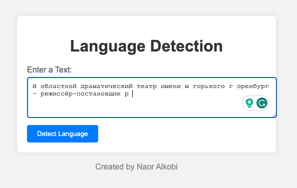
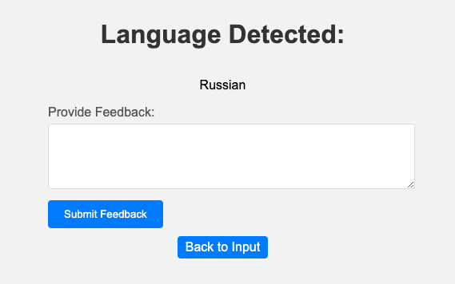

# Language Detection with Multinomial Naive Bayes

Welcome to the Language Detection using Multinomial Naive Bayes program! 

This Python project provides a hands-on demonstration of how to harness the power of the Multinomial Naive Bayes algorithm for accurate language detection. 

In the world of natural language processing, language detection plays a vital role in deciphering the languages in which textual data is written.
## Table of Contents

- [Introduction](#introduction)
- [Installation](#installation)
- [Usage](#usage)
- [Dataset](#dataset)
- [Implementation](#implementation)
- [Feedback Mechanism](#feedback-mechanism)
- [Contributing](#contributing)

## Introduction

This program showcases the usage of the Multinomial Naive Bayes algorithm to detect the language of input text. 

The Multinomial Naive Bayes classifier is a probabilistic algorithm that works well with text data and can be used for various natural language processing tasks.

## Installation

1. Clone this repository to your local machine using:

   ```bash
   git clone https://github.com/naoralkobi/languageDetection.git
   ```

2. Navigate to the project directory:

   ```bash
   cd languageDetection
   ```

3. Install the required dependencies:

   ```bash
   pip3 install virtualenv
   virtualenv -p python3 venv
   source venv/bin/activate
   pip3 install -r requirements.txt
   ```

## Usage

1. Run the language detection application:

   ```bash
   python3 app.py
   ```

2. Open your web browser and navigate to http://localhost:5000.
   
3. Enter the text you want to detect the language for and submit the form.

## Dataset

The dataset used for training and testing the Multinomial Naive Bayes classifier consists of text samples from various languages. The dataset should be preprocessed and split into training and testing sets before training the classifier.

## Implementation Details

The program structure includes:

- `app.py`: The main Flask application that handles routing, form submissions, and rendering templates.

- `templates`: Contains HTML templates for user interface.

- `static`: Contains static files like CSS for styling.

## Feedback Mechanism

This program includes a feedback mechanism that allows users to correct the predicted language if it's incorrect. Feedback collected can be used to improve the model over time.



## Contributing

Contributions to this project are welcome! If you find any issues or want to enhance the program, feel free to create a pull request.

1. Fork the repository.

2. Create a new branch.

3. Make your changes and enhancements.

4. Test thoroughly.

5. Create a pull request explaining your changes and improvements.
